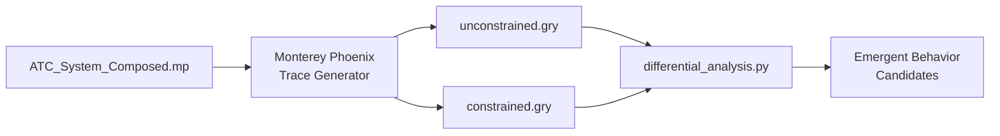

# ATC System-of-Systems — Model Writeup

## Overview

[ATC_System_Composed.mp](file:///d:/Research/NSA%20INSuRE+C/Summer/May/ATC_System_Composed.mp) is a Monterey Phoenix (MP) behavior-trace model of a terminal/en-route Air Traffic Control system, composed as a **system of systems (SoS)**. It contains **8 ROOT components**, **~45 top-level states**, **~75 sub-events**, **9 ordering constraints**, **26 presence constraints**, and **7 coordination blocks**.

Every component, state, sub-event, constraint, and coordination rule is grounded in real, published ATC documentation — no states are invented or hypothetical.

---

## Source Documentation

The model draws from the following authoritative references:

| Ref ID | Document | What it provided |
|--------|----------|-----------------|
| **D1** | ICAO Doc 4444 (PANS-ATM, 16th Ed.) | ATC procedures: clearances, separation, handoffs, flight plan processing, holding |
| **D2** | ICAO Doc 9854 | Global ATM Operational Concept — system decomposition |
| **D3** | FAA Order 7110.65 | Controller procedures for Clearance Delivery, Ground, Local, Departure, Approach positions |
| **D4** | FAA NAS Enterprise Architecture | ERAM, STARS, TFMS, TBFM, TFDM facility decomposition |
| **D5** | EUROCONTROL ASTERIX Specification | CAT048 (SSR/Mode-S tracks), CAT021 (ADS-B reports), CAT062 (fused system tracks) |
| **D6** | ICAO Annex 10 Vol IV | CPDLC uplink/downlink message sets |
| **D7** | DO-185B / ICAO Doc 9863 | ACAS/TCAS II logic — Traffic Advisories (TA) and Resolution Advisories (RA) |
| **D8** | RTCA DO-260B | ADS-B transponder standards |
| **D9** | FAA SWIM Architecture | System Wide Information Management — SOA data exchange (TFMS, TBFM, TFDM) |

---

## Components

### 1. Aircraft (13 states)

```
ROOT Aircraft :
    ( ac_parked_at_gate  | ac_taxi_out    | ac_holding_short
    | ac_takeoff_roll    | ac_departure   | ac_en_route
    | ac_arrival_descent | ac_final_approach | ac_landing_roll
    | ac_taxi_in         | ac_holding_pattern | ac_diverting
    | ac_emergency );
```

**Real-world mapping:** An individual airframe plus its onboard avionics suite (Mode-S transponder, FMS, TCAS II).

**States trace the canonical flight phases** defined in ICAO Doc 4444 and FAA 7110.65:

| State | Flight Phase | Key Sub-Events | Source |
|-------|-------------|-----------------|--------|
| `ac_parked_at_gate` | Pre-flight | `atis_received`, `fpl_filed` | D1 §4.4 (ATIS), §4.3 (FPL) |
| `ac_taxi_out` | Ground movement | `squawk_assigned`, `taxi_clearance_received` | D3 §3-7 (ground control) |
| `ac_holding_short` | Runway hold | `awaiting_lineup_clearance` | D3 §3-9 |
| `ac_takeoff_roll` | Takeoff | `takeoff_clearance_received`, `transponder_mode_s_active` | D3 §3-9, D8 |
| `ac_departure` | Initial climb / SID | `airborne`, `sid_following`, `initial_climb` | D1 §6.2 |
| `ac_en_route` | Cruise | `airborne`, `flight_level_assigned`, `position_reporting` | D1 §8.6 |
| `ac_arrival_descent` | STAR / descent | `airborne`, `star_following`, `descending` | D1 §6.5 |
| `ac_final_approach` | ILS/visual final | `airborne`, `approach_clearance_received`, `localizer_captured` | D1 §6.5.3 |
| `ac_landing_roll` | Rollout | `on_runway`, `speed_decelerating` | D3 §3-10 |
| `ac_taxi_in` | Post-landing taxi | `taxi_clearance_received`, `squawk_standby` | D3 §3-7 |
| `ac_holding_pattern` | Published hold | `airborne`, `holding_clearance_received`, `expect_further_clearance` | D1 §6.4 |
| `ac_diverting` | Diversion | `airborne`, `diversion_clearance` | D1 §4.6 |
| `ac_emergency` | Emergency / TCAS RA | `squawk_7700`, `[tcas_ra_active]` (optional) | D7 §3.2, D1 §15.1 |

> [!NOTE]
> The `[tcas_ra_active]` sub-event is **optional** (MP bracket syntax). An emergency can occur without a TCAS RA (e.g., engine failure, medical emergency), but a TCAS RA always triggers the emergency state.

---

### 2. Tower_Control (5 states)

```
ROOT Tower_Control :
    ( twr_clearance_delivery | twr_ground_control
    | twr_local_control      | twr_combined_position
    | twr_closed );
```

**Real-world mapping:** Air Traffic Control Tower (ATCT) — the physical control tower at an airport.

States correspond directly to the **controller positions** defined in FAA Order 7110.65:

| State | Position | Responsibilities |
|-------|----------|-----------------|
| `twr_clearance_delivery` | Clearance Delivery (CD) | Issues IFR clearances, assigns squawk codes and departure frequencies |
| `twr_ground_control` | Ground Control (GC) | Manages taxiway movement, runway crossing coordination, surface surveillance |
| `twr_local_control` | Local Control (LC) | Issues takeoff/landing clearances, sequences traffic, scans final approach |
| `twr_combined_position` | Combined (low-traffic) | Single controller covers Ground + Local duties simultaneously |
| `twr_closed` | Tower closed | No ATC service available (uncontrolled airport operations) |

> [!IMPORTANT]
> `twr_combined_position` models a real operational mode at smaller airports where a single controller handles both ground and local duties. This is standard practice per FAA 7110.65 §2-1.

---

### 3. TRACON (5 states)

```
ROOT TRACON :
    ( tracon_departure_active | tracon_approach_active
    | tracon_combined_ops     | tracon_saturated
    | tracon_offline );
```

**Real-world mapping:** Terminal Radar Approach Control facility, running **STARS** (Standard Terminal Automation Replacement System) automation. Handles aircraft within ~50 NM / ~18,000 ft of a major airport.

| State | Function | Key Sub-Events |
|-------|----------|----------------|
| `tracon_departure_active` | Departure control | `radar_contact_established` → `issuing_climb_clearance` → `vectoring_to_airway` → `handoff_to_center` |
| `tracon_approach_active` | Approach control | `receiving_handoff_from_center` → `issuing_descent_clearance` → `sequencing_arrivals` → `vectoring_to_final` |
| `tracon_combined_ops` | Single-sector ops | Handles both departure and approach simultaneously |
| `tracon_saturated` | Overloaded | Sequencing continues but `workload_exceeded` — models a capacity-limited degraded mode |
| `tracon_offline` | No terminal radar | TRACON facility not providing service |

---

### 4. ARTCC (5 states)

```
ROOT ARTCC :
    ( center_sector_active  | center_sector_combined
    | center_flow_restricted | center_adsb_only
    | center_offline );
```

**Real-world mapping:** Air Route Traffic Control Center — en-route facility running **ERAM** (En Route Automation Modernization). The FAA operates 21 ARTCCs providing IFR separation across the continental US.

| State | Operational Mode | Key Sub-Events |
|-------|-----------------|----------------|
| `center_sector_active` | Normal sector operations | `providing_separation`, `issuing_flight_level_changes`, `processing_handoffs`, `conflict_detection_active` |
| `center_sector_combined` | Combined sector (low traffic) | Fewer controllers, reduced automation features |
| `center_flow_restricted` | Traffic management initiative active | `miles_in_trail_enforced` — spacing restrictions applied per ATCSCC |
| `center_adsb_only` | Degraded surveillance | Only ADS-B data available (radar sensors offline) |
| `center_offline` | Center not providing service | Complete facility outage |

> [!NOTE]
> `conflict_detection_active` maps to the ERAM Conflict Alert (CA) function, which scans system tracks for predicted losses of separation. This is required to precede any flight level change instruction (FAA 7110.65 §5-8).

---

### 5. Surveillance_System (5 states)

```
ROOT Surveillance_System :
    ( surv_full_coverage    | surv_degraded_psr_only
    | surv_degraded_ssr_only | surv_adsb_only
    | surv_no_coverage );
```

**Real-world mapping:** The composite surveillance infrastructure — Primary Surveillance Radar (PSR), Secondary Surveillance Radar (SSR/Mode-S), ADS-B ground stations, and multilateration (MLAT) sensors.

**Sub-events are named after real EUROCONTROL ASTERIX data categories:**

| Sub-Event | ASTERIX Category | Description |
|-----------|-----------------|-------------|
| `psr_operational` | — | Primary radar (skin paint) active |
| `ssr_mode_s_operational` | — | Mode-S selective interrogation active |
| `adsb_receiving` | — | ADS-B ground station receiving 1090ES broadcasts |
| `asterix_cat048_transmitting` | **CAT048** | Monoradar target reports (SSR/Mode-S) transmitted |
| `asterix_cat021_transmitting` | **CAT021** | ADS-B target reports transmitted |
| `system_track_cat062` | **CAT062** | Fused multi-sensor system tracks produced |

This decomposition reflects the real **data fusion pipeline**: raw sensor data (CAT048 from radar, CAT021 from ADS-B) is ingested by a tracker that produces fused system tracks (CAT062) consumed by ERAM and STARS automation.

---

### 6. Comm_System (5 states)

```
ROOT Comm_System :
    ( comm_voice_and_cpdlc | comm_voice_only
    | comm_cpdlc_only      | comm_backup_frequency
    | comm_total_failure );
```

**Real-world mapping:** The air-ground communication infrastructure per ICAO Annex 10.

| State | Technology Active | Source |
|-------|------------------|--------|
| `comm_voice_and_cpdlc` | VHF radio + Controller-Pilot Data Link Communication | D6 — full NextGen comms |
| `comm_voice_only` | VHF radio only | Legacy operations |
| `comm_cpdlc_only` | Data link only (oceanic/remote) | D6 §3.5 — oceanic airspace |
| `comm_backup_frequency` | Backup VHF | Emergency guard frequency (121.5 MHz) |
| `comm_total_failure` | No communication | Squawk 7600 scenario |

> [!IMPORTANT]
> The CPDLC sub-events (`cpdlc_uplink_active`, `cpdlc_downlink_active`) model the **real message flow** per ICAO Annex 10 Vol IV: the controller sends an uplink message (e.g., UM-79 "CLIMB TO FL350"), and the pilot responds with a downlink (e.g., DM-0 "WILCO"). The ordering constraint `ENSURE FOREACH $u: cpdlc_uplink_active, $d: cpdlc_downlink_active ($u BEFORE $d)` enforces this protocol sequence.

---

### 7. Flow_Management (6 states)

```
ROOT Flow_Management :
    ( flow_normal       | flow_mit_applied
    | flow_gdp_active   | flow_gs_active
    | flow_afp_active   | flow_edct_assigned );
```

**Real-world mapping:** The FAA Air Traffic Control System Command Center (ATCSCC) and its automation — **TFMS** (Traffic Flow Management System), **TBFM** (Time-Based Flow Management), published via **SWIM** (System Wide Information Management).

States correspond to real **Traffic Management Initiatives (TMIs):**

| State | TMI Type | Description | Source |
|-------|----------|-------------|--------|
| `flow_normal` | None | TFMS monitoring, TBFM scheduling normal | D9 |
| `flow_mit_applied` | Miles-in-Trail (MIT) | Spacing restriction between aircraft on same route | D3 §17-1 |
| `flow_gdp_active` | Ground Delay Program (GDP) | Delays assigned at origin to manage arrival demand | D9 (TFMS) |
| `flow_gs_active` | Ground Stop (GS) | All departures to an airport halted | D3 §17-2 |
| `flow_afp_active` | Airspace Flow Program (AFP) | Reroutes published for constrained airspace | D9 (TFMS) |
| `flow_edct_assigned` | EDCT | Expected Departure Clearance Times assigned to flights | D9 (TFMS) |

> [!NOTE]
> `swim_publishing` appears as a sub-event of `flow_gdp_active` because a GDP **requires** SWIM's NAS Enterprise Messaging Service (NEMS) to distribute EDCT assignments to airlines, TFDM systems, and other consumers. This is enforced by a REJECT constraint.

---

### 8. Weather_System (5 states)

```
ROOT Weather_System :
    ( wx_vmc_conditions  | wx_imc_conditions
    | wx_convective_sigmet | wx_windshear_alert
    | wx_low_visibility_ops );
```

**Real-world mapping:** FAA Integrated Terminal Weather System (ITWS), Terminal Doppler Weather Radar (TDWR), NWS products (METAR, TAF, SIGMET), and ATIS/D-ATIS.

| State | Met. Condition | Key Sub-Events |
|-------|---------------|----------------|
| `wx_vmc_conditions` | Visual Meteorological Conditions | `ceiling_above_minimums`, `visibility_above_minimums` |
| `wx_imc_conditions` | Instrument Meteorological Conditions | `ceiling_below_vfr`, `instrument_approaches_required` |
| `wx_convective_sigmet` | Thunderstorm activity | `sigmet_issued`, `convective_cells_detected` |
| `wx_windshear_alert` | Windshear detected | `tdwr_alert_active`, `pirep_windshear` |
| `wx_low_visibility_ops` | CAT II/III conditions | `rvr_reporting`, `cat_ii_iii_procedures` |

All weather states include `metar_reporting` because every airport with ATC service continuously publishes METAR observations (ICAO Annex 3, WMO No. 49).

---

## Ordering Constraints (ENSURE FOREACH)

These enforce **temporal precedence** between events based on real procedural sequences. MP will reject any trace where the ordering is violated.

| # | Constraint | Regulatory Basis |
|---|-----------|-----------------|
| 1 | IFR clearance → squawk assignment | ICAO 4444 §4.5: clearance delivered before transponder activation |
| 2 | Radar contact → climb clearance | ICAO 4444 §7.6: radar identification required before radar-based vectors |
| 3 | Conflict detection → flight level change | FAA 7110.65 §5-8: ERAM CA must run before issuing altitude changes |
| 4 | Approach clearance → localizer capture | ICAO 4444 §6.5: clearance precedes ILS establishment |
| 5 | EDCT computation → GDP activation | FAA TFMS: delay times must be calculated before program begins |
| 6 | ASTERIX CAT048 → CAT062 system track | EUROCONTROL ASTERIX: raw radar data must exist before fusion |
| 7 | ASTERIX CAT021 → CAT062 system track | Same — raw ADS-B data before fusion |
| 8 | CPDLC uplink → CPDLC downlink | ICAO Annex 10 Vol IV: controller message precedes pilot response |
| 9 | TDWR alert → windshear PIREP | NWS/FAA: ground detection precedes pilot report in sequence |

---

## Presence Constraints (REJECT)

These are **hard invariants** — state combinations that are physically impossible or regulatory violations. They are grouped by dependency type:

### Surveillance Dependencies (3 rules)
- **No separation without surveillance** (ICAO 4444 §8.1)
- **Mode-S transponder requires SSR or ADS-B receiver**
- **ADS-B-only center mode requires ADS-B receiver active**

### Communication Dependencies (6 rules)
- **No clearances during total comm failure** — 5 separate rules covering IFR, takeoff, landing, climb, and descent clearances (ICAO 4444 §3.6)
- **CPDLC requires data-link-capable comm state** (ICAO Annex 10 Vol IV)

### Flow Management Dependencies (3 rules)
- **Ground stop prohibits takeoff clearance** (ATCSCC procedures)
- **GDP requires SWIM publishing** (FAA SWIM SOA)
- **MIT in flow management must be enforced at ARTCC** (TFMS → ERAM coordination)

### Weather Dependencies (3 rules)
- **Low-vis ops require RVR equipment** (FAA 7110.65 §2-6)
- **Localizer capture during low-vis requires CAT II/III procedures**
- **No departures during convective SIGMET + ground stop**

### TCAS/Emergency (2 rules)
- **TCAS RA requires airborne state** (DO-185B / ICAO Doc 9863)
- **Squawk 7700 requires emergency state**

### Facility Constraints (6 rules)
- **Tower closed → no taxi instructions, takeoff clearances, or landing clearances**
- **TRACON offline → no vectoring**
- **ARTCC offline → no separation service**
- **No airborne aircraft if all ATC facilities simultaneously offline**

### Handoff Protocol (4 rules)
- **Handoff to center requires TRACON departure active** (ICAO 4444 §3.3.2)
- **Receiving handoff from center requires center active**
- **Processing handoffs requires communication link**
- **Holding pattern requires some ATC facility issuing clearances**

---

## Coordination Blocks (PRECEDES)

These model **real-time data exchange** between systems. Each maps to a real protocol or data feed:

| # | Data Flow | Real Protocol | MP Coordination |
|---|-----------|--------------|-----------------|
| 1 | Surveillance → ARTCC | ASTERIX CAT062 → ERAM | `system_track_cat062` PRECEDES `conflict_detection_active` |
| 2 | Surveillance → TRACON | ASTERIX CAT048 → STARS | `asterix_cat048_transmitting` PRECEDES `sequencing_arrivals` |
| 3 | Flow Mgmt → Tower | TFMS → TFDM → ATCT | `ground_stop_issued` PRECEDES `issuing_ifr_clearance` |
| 4 | Weather → Flow Mgmt | NWS SIGMET → ATCSCC/TFMS | `sigmet_issued` PRECEDES `ground_delay_program` |
| 5 | Weather → Flow Mgmt | NWS SIGMET → ATCSCC | `sigmet_issued` PRECEDES `ground_stop_issued` |
| 6 | Weather → Tower | TDWR → ATCT | `tdwr_alert_active` PRECEDES `scanning_final` |
| 7 | Comm → ARTCC | VHF/CPDLC → ERAM workstation | `vhf_transmitting` PRECEDES `providing_separation` |

---

## Model Statistics

| Metric | Count |
|--------|-------|
| ROOT components | 8 |
| Top-level states | 49 |
| Sub-events (leaf nodes) | ~75 |
| ENSURE FOREACH ordering constraints | 9 |
| REJECT presence constraints | 26 |
| COORDINATE blocks | 7 |

### State-Space Estimate

The unconstrained state space is the product of states per component:

$$13 \times 5 \times 5 \times 5 \times 5 \times 5 \times 6 \times 5 = 1{,}218{,}750 \text{ combinations}$$

The 26 REJECT constraints and 9 ENSURE FOREACH rules will prune a significant fraction of these, producing a constrained trace corpus substantially smaller than the unconstrained one — which is precisely what our differential analysis methodology needs.

---

## How This Fits the Project Methodology



1. **Generate traces**: Run the `.mp` model in Monterey Phoenix at scope 1 (one instance per ROOT) to produce constrained and unconstrained `.gry` trace files.
2. **Parse & load**: Use `parse_smart_home.py` (adapted for ATC events) or `scanner.py` to parse traces into a SQLite database.
3. **Differential analysis**: Run `differential_analysis.py` to compare:
   - **State-frequency deviations** between constrained and unconstrained corpora
   - **Co-occurrence lift** — which state pairs appear together far more (or less) often than expected
   - **Precedence violations** — orderings that appear in unconstrained but are pruned by constraints
4. **Identify emergent behaviors**: State combinations or orderings that the constraints eliminate are candidates for **emergent behavior** — behaviors that arise from the interaction of independently-designed systems and violate architectural intent.

### What Makes This Model Useful for Scale Testing

| Property | Smart Home Model | ATC Model |
|----------|-----------------|-----------|
| ROOT components | 7 | 8 |
| Top-level states | 30 | 49 |
| Unconstrained combinations | ~1.5M | ~1.2M |
| Constraint types | REJECT only | REJECT + ENSURE FOREACH + COORDINATE |
| Domain | Consumer IoT | Safety-critical aviation |
| Protocol grounding | SunSpec, OCPP, IEEE 2030.5 | ICAO 4444, ASTERIX, CPDLC, TCAS |

The ATC model provides a **second domain** for cross-domain validation of our detection methodology, with richer constraint types (ordering + coordination in addition to presence) and a safety-critical context where emergent behavior has direct operational consequences.
